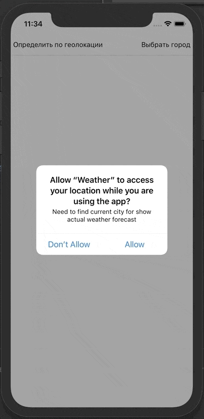

# rn-weather

Задача:
Разработать приложение погоды

Требования приложения:

1. Определение города пользователя по геопозиции
2. Возможность смены города
3. Возможность просмотра погоды в другом городе
4. Обновление погоды по свайпу страницы вниз (как в ВК)
5. На странице с погодой должно быть написано когда было последнее обновление (сейчас, 10 минут назад и т.д.)
6. Дизайн на свой вкус

Страницы:

1. Домашняя страница, где показывается погода в выбранном городе.
2. Страница поиска города с автокомплитом
3. Страница просмотра погоды в другом городе (при поиске). Здесь же кнопка выбора этого города как дефолтного.

Технические требования:

1. Роутинг
2. Функциональные компоненты (хуки соответственно тоже)
3. Любое публичное API погоды
4. Стейт-менеджер redux, но предпочтительней rematch
5. Грамотная файловая структура
6. Разделение компонентов на презентеры/контейнеры
7. eslint
8. Тестирование бизнес-логики будет плюсом

# Решение

&nbsp;&nbsp;&nbsp;

Примерный алгоритм работы: 
При запуске приложение проверяет был ли сохранен город в Async Storage, если был, то погоду отображает для него, если нет,
то пытается получить данные по геопозиции, если предоставлены права, иначе же отправляет на ручной поиск города,
автокомплит городов сделан с помощью API dadata.ru, поэтому там доступны только русские города.
 API погоды https://openweathermap.org/api
